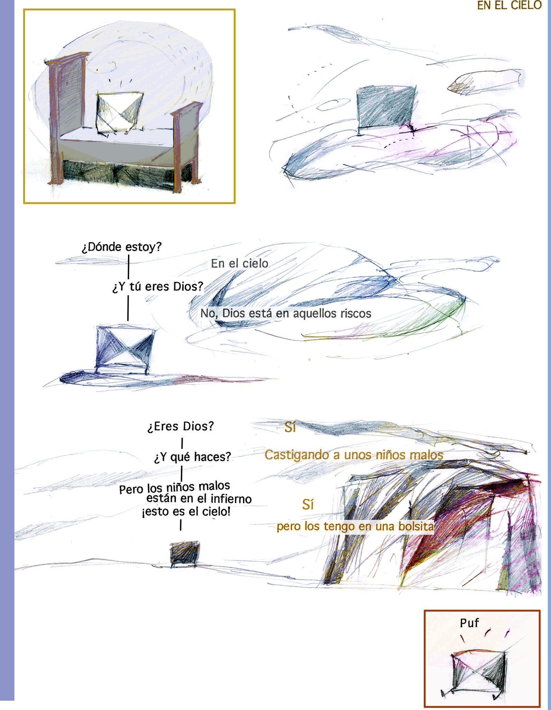
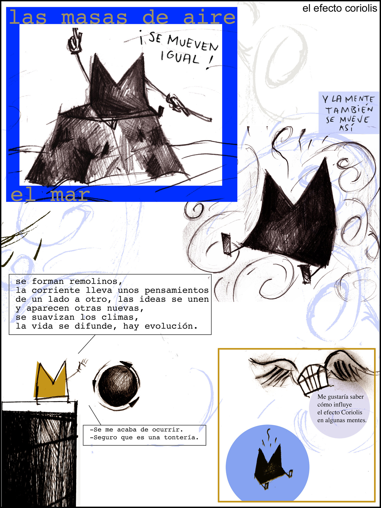
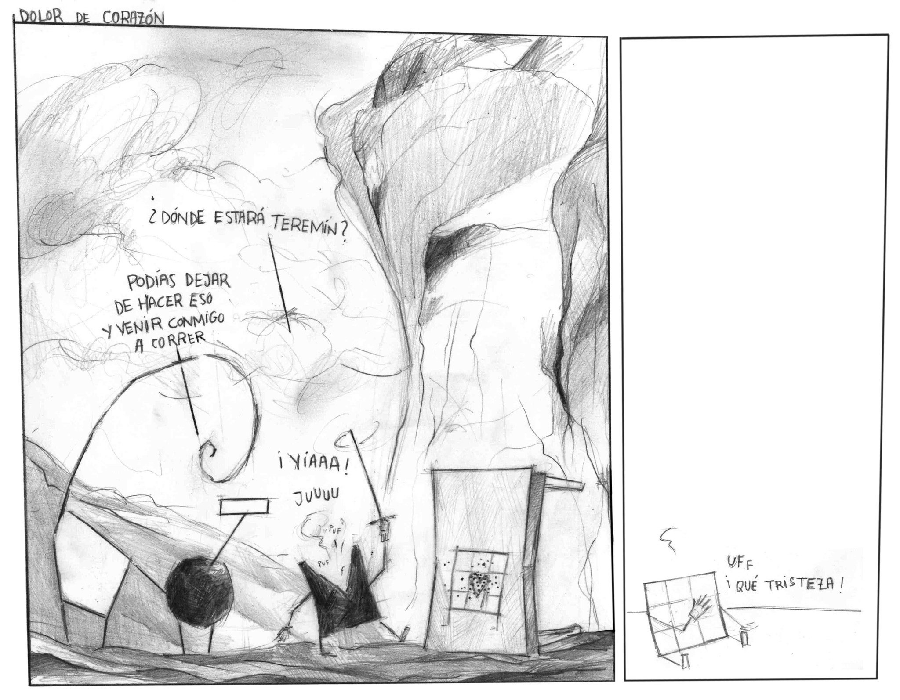
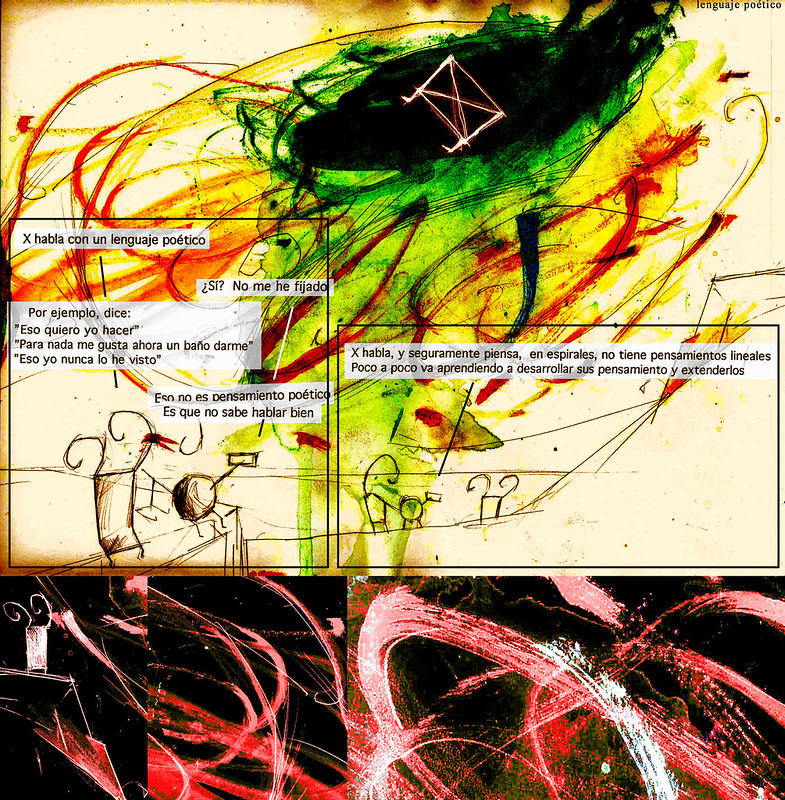
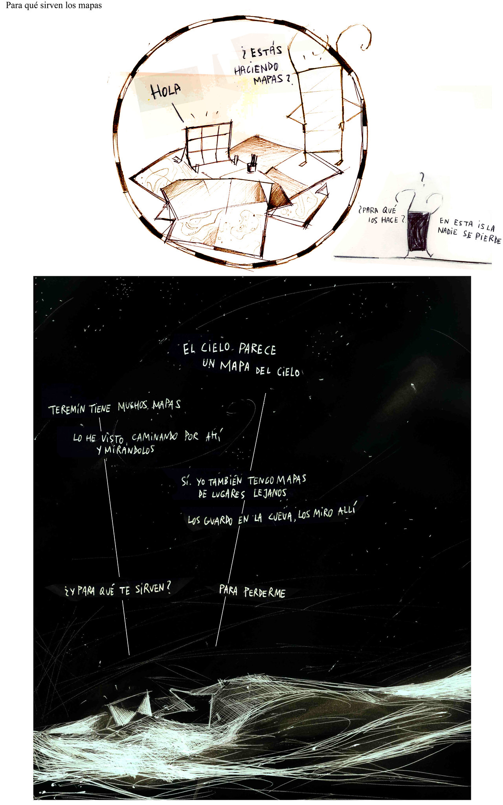
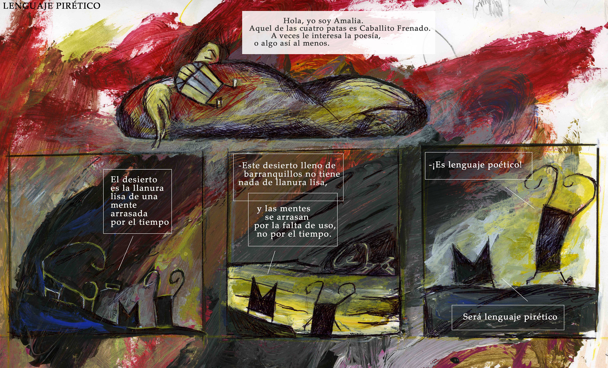
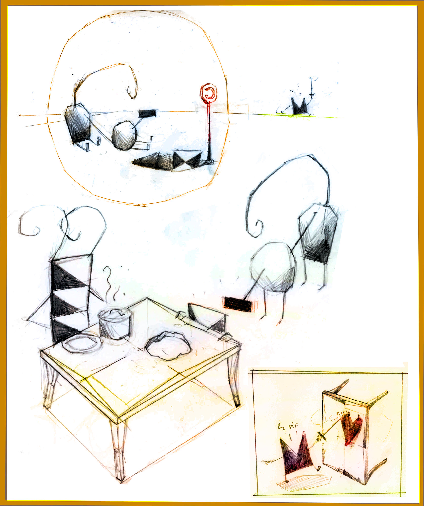

Espinita empezó, hacia 1986, con dibujos muy toscos de tres personajes, Espín, Siete y Caballito Frenado aunque en ese momento no tenían nombre. A lo largo de los años, los dibujos se han definido igual que los nombres de los lugares y de los personajes y han llegado algunos más, como X, Teremín, Diana o Amalia.

El territorio donde se desarrolla esta historia tiene lugares como desiertos; malpaises; islas llena de otros lugares; cuevas, barrancos y barranquillos; picos; montes; paredes; charcos; playas; mar; cielos con nubes.

Con Espinita yo (Mataparda) sigo creyendo en el cómic, o la narración gráfica, como un medio potente y valioso para que un alguien comunique sus ideas.
En cuanto a la técnica narrativa, intento que sea depurada y que a la vez cada historia pueda leerse en varios niveles. Gráficamente creo necesaria la experimentación constante. Me gusta mezclar los medios tradicionales (lápiz, acuarela, lápices de colores, tinta, collage) con el tratamiento digital.

Esta historia surge, sin duda, influenciada por el descubrimiento personal de Krazy Kat de Herriman, y justo a su lado cosas como Kin-der-Kids de Feininger, Calvin y Hobbes o Mutts, aunque no son estas las únicas fuentes de Espinita

---

---

---

---

---

---

---

---

